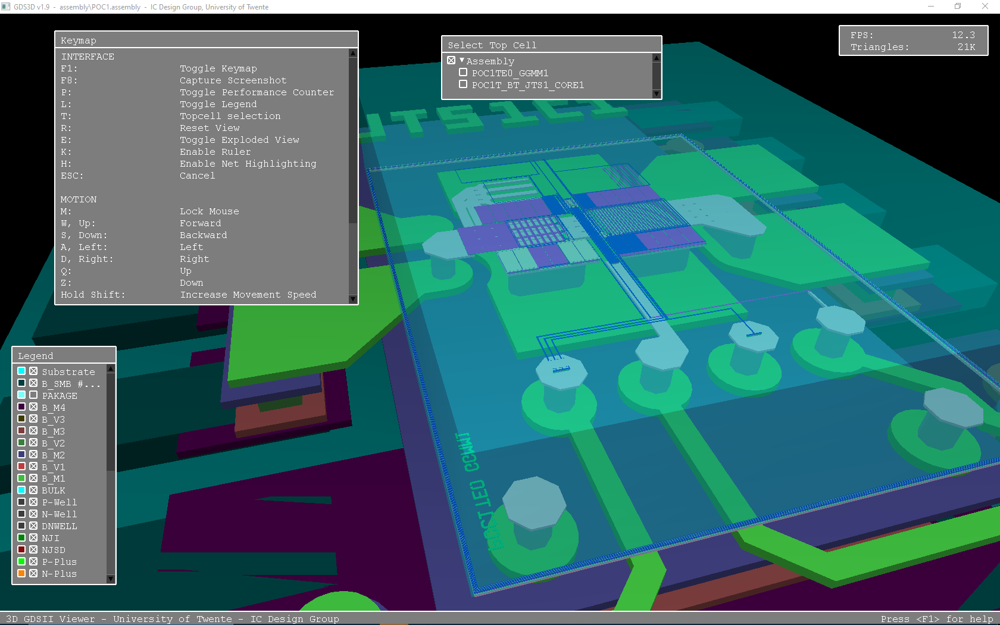

# GDS3D — Interactive 3D IC Layout Viewer

> **Render GDSII chip layouts in real-time 3D.** Navigate your IC design like a video game.



---

## Attribution & Lineage

This repository is a **Windows-runnable fork** of the original GDS3D project.
All intellectual credit belongs to the original authors listed below.

| Role | Person / Organisation |
|------|-----------------------|
| **Original authors** | Jasper Velner & Michiel Soer |
| **Original institution** | IC-Design Group, University of Twente |
| **Original project page** | <http://www.icd.el.utwente.nl/> |
| **Upstream fork (assembly + GMSH)** | Bertrand Pigeard — [@trilomix](https://github.com/trilomix/GDS3D) |
| **Alternate fork (compression + server/client)** | [@skuep](https://github.com/skuep/GDS3D) |

### What this fork adds

This fork I created after the original binary failed to run out-of-the-box on a modern Windows 11 machine.
The debugging and fix process was done interactively with [Claude](https://claude.ai) (Anthropic) — a vibe-debugging session that diagnosed the working-directory issue, verified OpenGL compatibility, and produced a polished GUI launcher.

**Changes made on top of [@trilomix/GDS3D](https://github.com/trilomix/GDS3D):**

- `LAUNCH GDS3D.cmd` — one double-click to open the GUI launcher (no terminal needed)
- `GDS3D_Launcher.ps1` — Windows GUI with file-picker, recent-files memory, and tech-file dropdown
- `README_WINDOWS.md` — detailed Windows-only quick-start and controls reference
- Cleaned up build artifacts, VS IDE state, and Gmsh output files
- Updated `.gitignore` for VS 2017+, debug binaries, and generated output

**No source code was modified.** The C++ engine is identical to upstream.

---

## Quick Start — Windows

> **Requires:** Windows 7 or later · Any GPU with OpenGL 1.5+ · No installation needed

### 1. Download / Clone

```
git clone https://github.com/<your-username>/GDS3D.git
```

Or download and extract the ZIP from GitHub.

### 2. Open the Launcher

Double-click **`LAUNCH GDS3D.cmd`** in this folder.

```
┌──────────────────────────────────────────────────────────┐
│  GDS3D Launcher  v1.9                                    │
├──────────────────────────────────────────────────────────┤
│  1. GDS File      [ path/to/your.gds    ]  [ Browse ]   │
│     Recent:       counter_4bit.gds                       │
├──────────────────────────────────────────────────────────┤
│  2. Technology    [ SkyWater SKY130 (130nm CMOS)  ▼ ]   │
├──────────────────────────────────────────────────────────┤
│  3. Options       [x] Verbose output                     │
│                                                          │
│              [ Launch GDS3D >>> ]                        │
└──────────────────────────────────────────────────────────┘
```

1. Click **Browse** → pick any `.gds` file from anywhere on your PC
2. Choose the matching **technology** from the dropdown
3. Click **Launch GDS3D** → a 3D window opens

The launcher remembers the last 6 files you opened.

### Available Technologies

| Dropdown option | Use for |
|----------------|---------|
| SkyWater SKY130 (130nm CMOS) | Open-source chips — Efabless, Google shuttle |
| SkyWater SKY130 S10 variant | SKY130 SRAM variant |
| IHP SG13G2 (130nm SiGe BiCMOS) | IHP open-source BiCMOS |
| Generic / Example (mock process) | Bundled example GDS |
| Browse for custom tech file… | Any hand-written `.txt` tech file |

---

## Controls

| Key / Action | Effect |
|---|---|
| `W` `A` `S` `D` / Arrow keys | Move camera |
| `Q` / `Z` | Move up / down |
| Left mouse drag | Rotate view |
| Right mouse drag | Walk & strafe |
| Scroll wheel | Zoom |
| `R` | Reset camera |
| `L` | Toggle layer legend |
| `E` | Exploded view — spreads layers apart |
| `H` | Net highlight — click a metal to trace it |
| `T` | Select top cell |
| `K` | Place a ruler |
| `M` | Lock mouse (FPS-style camera) |
| `P` | Performance counter (FPS + triangle count) |
| `F` | Export geometry to GMSH `.geo` file |
| `F1` | Full keymap reference |
| `F8` | Screenshot |
| `ESC` | Cancel / exit |

---

## Command-Line Usage

```bat
win32\GDS3D.exe -p techfiles\sky130.txt -i path\to\your.gds
```

| Flag | Description |
|------|-------------|
| `-p <file>` | Process / tech file **(required)** |
| `-i <file>` | Input GDSII file **(required)** |
| `-a <file>` | Assembly definition file (alternative to `-p -i`) |
| `-t <cell>` | Specify top cell name |
| `-v` | Verbose output |
| `-h` | Show help |

---

## Project Structure

```
GDS3D-master/
├── LAUNCH GDS3D.cmd          ← double-click to open launcher  (this fork)
├── GDS3D_Launcher.ps1        ← GUI launcher source            (this fork)
├── README.md                 ← this file
├── README_WINDOWS.md         ← detailed Windows guide         (this fork)
├── win32/
│   ├── GDS3D.exe             ← pre-built Windows 32-bit binary (upstream)
│   ├── GDS3D.sln             ← Visual Studio solution
│   └── main.cpp              ← Windows entry point
├── gds/
│   ├── example.gds           ← bundled example layout
│   └── example_sky130.gds    ← SKY130 example
├── techfiles/
│   ├── sky130.txt            ← SkyWater SKY130 process
│   ├── sky130_s10.txt        ← SKY130 S10 variant
│   ├── sg13g2.txt            ← IHP SG13G2 process
│   └── example.txt           ← generic mock process
├── gdsoglviewer/             ← OpenGL rendering engine (C++)
├── libgdsto3d/               ← GDSII parser library (C++)
├── math/                     ← math utilities
├── linux/                    ← Linux Makefile & build
├── mac/                      ← macOS Xcode project & build
├── skill/                    ← Cadence Virtuoso integration scripts
└── assembly/                 ← multi-GDS assembly examples
```

---

## Building from Source

### Windows (Visual Studio 2017+)

1. Open `win32\GDS3D.sln`
2. Select **Release | Win32** (or Release | x64)
3. Build — exe appears in `win32\` (Win32) or `win32\x64\Release\` (x64)

### Linux

```bash
# Ubuntu / Debian — install dependencies
sudo apt install g++ libgl1-mesa-dev libglu1-mesa-dev libx11-dev

# Build
make -C linux

# Run
./linux/GDS3D -p techfiles/example.txt -i gds/example.gds
```

### macOS

```bash
make -C mac
./mac/GDS3D -p techfiles/example.txt -i gds/example.gds
```

---

## Writing a Custom Tech File

Each layer is a block of key-value pairs between `LayerStart` / `LayerEnd`.
The **first layer must always be the substrate** (GDS layer `255`).

```
LayerStart: Metal 1
Layer:      68          # GDS layer number
Datatype:   20          # GDS datatype (omit to match any)
Height:     1376        # Bottom of layer in nm
Thickness:  360         # Layer thickness in nm
Red:        0.40        # RGB colour, range 0.0–1.0
Green:      0.60
Blue:       0.90
Filter:     0.0         # Transparency — keep at 0.0
Metal:      1           # 1 = metal (net-traceable), 0 = via / implant
Shortkey:   1           # Key 0–9 to toggle layer visibility
Show:       1           # 1 = visible at startup
LayerEnd
```

See [`techfiles/example.txt`](techfiles/example.txt) for a fully commented reference.

---

## License

GDS3D is free software licensed under the **GNU General Public License v2**
(due to the inclusion of Gmsh code). Without Gmsh code it is compatible with LGPL 2.1.

See [`LICENSE.txt`](LICENSE.txt) and [`LGPLLicense.txt`](LGPLLicense.txt).

### Third-party components used by GDS3D

| Library | Copyright |
|---------|-----------|
| [gds2pov](https://github.com/ralight/gds2pov) | © 2004–2008 Roger Light |
| Math library | © 2006 Paul Baker |
| [Clipper](http://www.angusj.com/delphi/clipper.php) | © 2010–2015 Angus Johnson |
| [Voro++](http://math.lbl.gov/voro++/) | © 2008 The Regents of the University of California |
| [Gmsh](https://gmsh.info/) | © 1997–2017 C. Geuzaine, J.-F. Remacle |

---

## Changelog (upstream)

| Version | Highlights |
|---------|-----------|
| **v1.9** | GMSH export, improved net-highlight speed for large designs |
| **v1.8** | Ruler system, hierarchical topcell window, net highlighting (beta) |
| **v1.7** | F8 screenshot, PCELL support |
| **v1.6** | Exploded view, layer shortkeys, macOS speed-up |
| **v1.5** | Interface overhaul, resizable panels |
| **v1.4** | OpenGL rewrite — 4× less VRAM, 2× more FPS |
| **v1.0** | Initial release |

Full history: [`CHANGELOG.txt`](CHANGELOG.txt)
