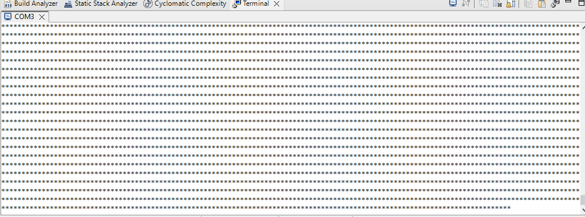
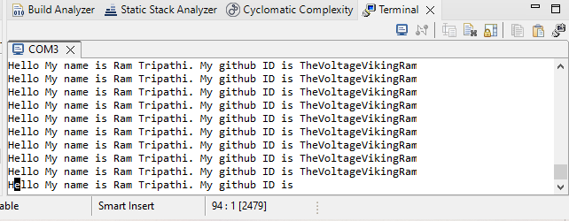

# STM32F446RE UART Transmit Driver (Bare-Metal)

This project demonstrates UART transmission using direct register-level programming on the STM32F446RE Nucleo board. It showcases two modes of UART usage — character-by-character transmission and full string transmission using `printf()` redirection.

## 🚀 Overview

- **Board:** STM32 Nucleo-F446RE  
- **UART Used:** USART2 (TX on PA2)  
- **Baud Rate:** 115200  
- **Clock Source:** Internal 16 MHz  
- **Toolchain:** STM32CubeIDE  
- **Coding Style:** Bare-metal (no HAL or CMSIS abstraction layers)  

## 🔧 Implementations

### 1. **Character Transmission**
- File: `characterprintuart.c`
- Demonstrates direct UART data register writing (`uart2_write()`).
- Each character is sent manually using a loop or function call.

📸 

---

### 2. **String Transmission**
- File: `print_multiple_char.c`
- Demonstrates `printf()` redirection to UART via `__io_putchar()`.
- Transmits full strings repeatedly in a loop.

📸  

